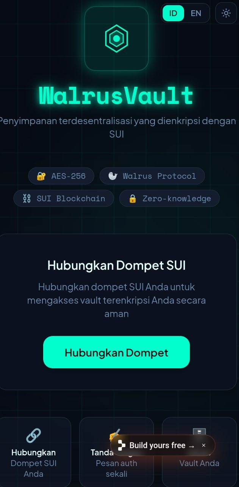
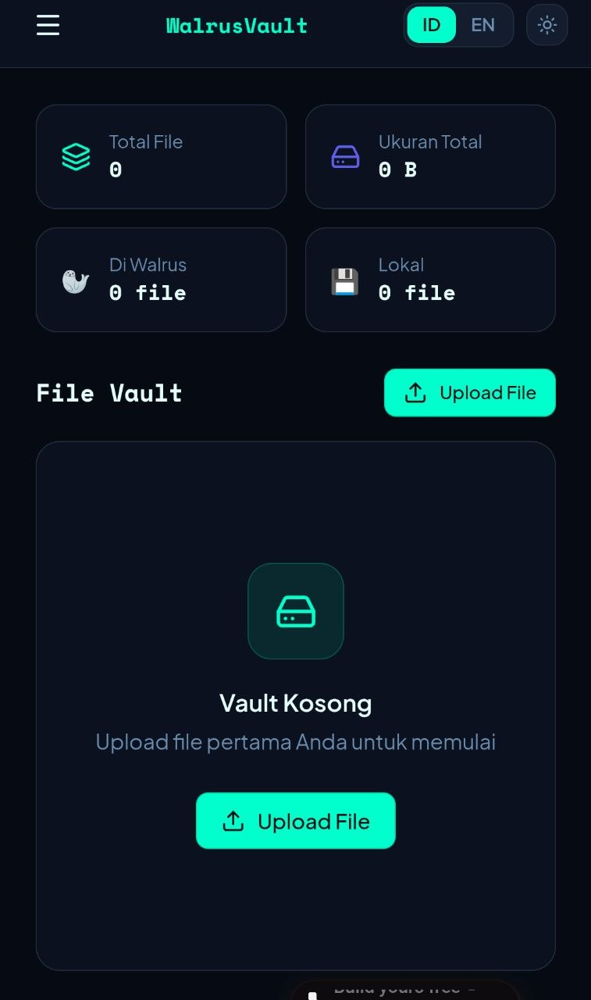
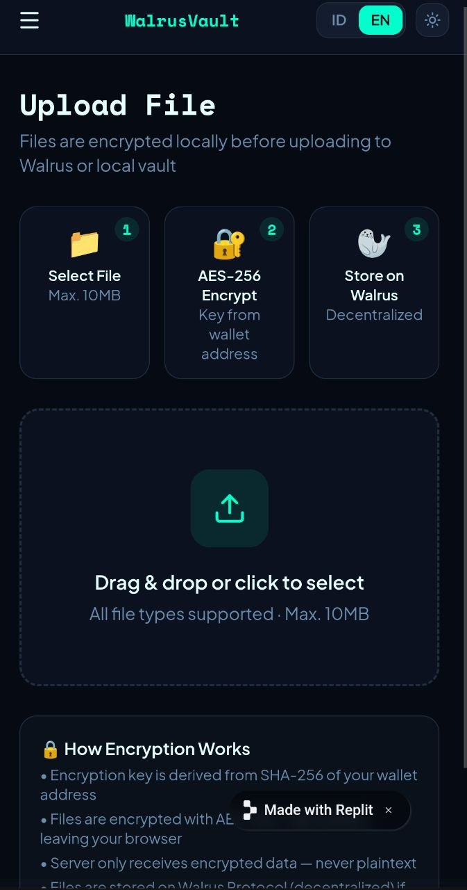
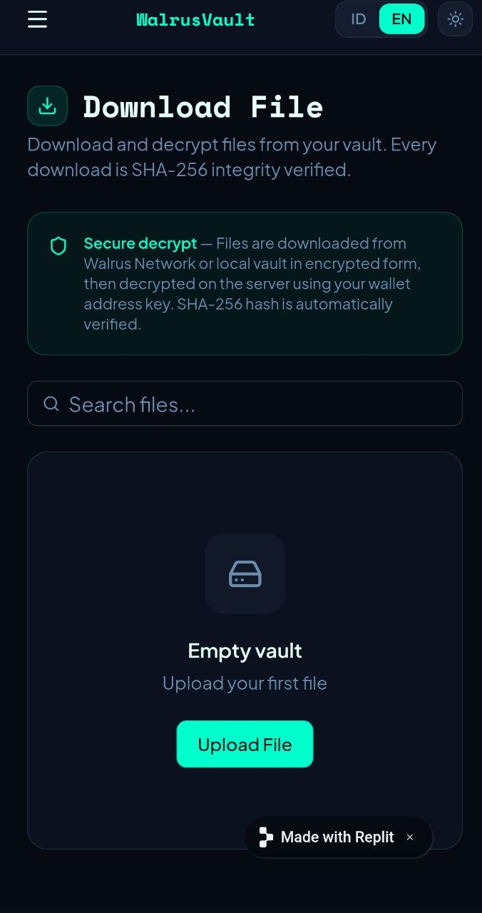
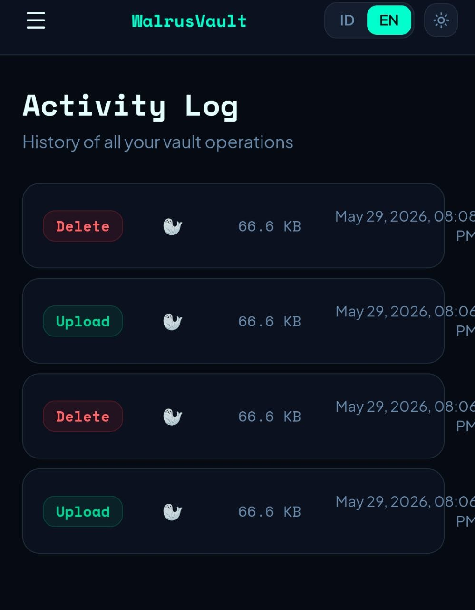
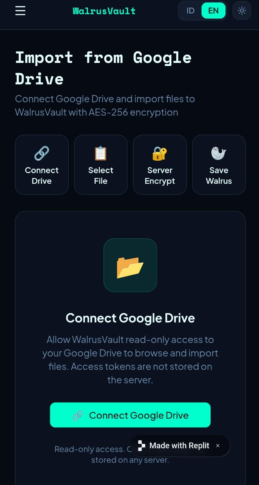

# WalrusVault

**Decentralized File Storage with SUI Wallet Authentication**

[](https://github.com/RamdanSe55/walrusvault)
[](LICENSE)
[](https://tatum.io/tatum-x-walrus-hackathon)

## 🚀 Live Demo

**Frontend:** https://walrus-drive-sync--haifa123co.replit.app/dashboard  
**Backend API:** https://stuffed-faculty-consciousness-harry.trycloudflare.com  
**GitHub:** https://github.com/RamdanSe55/walrusvault

---

## 📋 Overview

WalrusVault is a decentralized file storage platform that combines:
- **SUI Blockchain** for wallet-based authentication
- **Walrus Protocol** for decentralized storage
- **AES-256-CBC Encryption** for end-to-end security
- **Google Drive Bridge** for Web2 → Web3 migration

**No passwords. No servers. Just your wallet and Walrus.**

---

## ✨ Key Features

### Authentication
- ✅ Wallet-only login (no email, no password)
- ✅ SUI signature verification
- ✅ Zero-knowledge architecture

### Storage
- ✅ End-to-end encryption (AES-256-CBC)
- ✅ Decentralized storage (Walrus Protocol)
- ✅ 10MB file size limit
- ✅ Immutable file storage

### User Experience
- ✅ Drag & drop file upload
- ✅ One-click file download
- ✅ Google Drive import bridge
- ✅ Activity audit trail
- ✅ Dark/Light mode
- ✅ Multilingual (ID/EN)

### Analytics (via Tatum RPC)
- ✅ Wallet balance tracking
- ✅ Transaction history
- ✅ Activity statistics

---

## 🏗️ Architecture

```
┌─────────────────────────────────────────────────────────┐
│                    Frontend (React)                      │
│  - SUI Wallet Connect (@mysten/dapp-kit)               │
│  - File Upload/Download UI                             │
│  - Google Drive Import                                 │
│  - Activity Log Viewer                                 │
└────────────────────┬────────────────────────────────────┘
                     │ HTTPS
┌────────────────────▼────────────────────────────────────┐
│                  Backend (Express)                       │
│  - SUI Signature Verification                          │
│  - AES-256-CBC Encryption/Decryption                   │
│  - Walrus Publisher/Aggregator Integration             │
│  - Tatum RPC for Analytics                             │
│  - Activity Logging (Drizzle ORM)                      │
└────────────────────┬────────────────────────────────────┘
                     │
        ┌────────────┼────────────┐
        │            │            │
    ┌───▼──┐    ┌───▼──┐    ┌───▼──┐
    │Walrus│    │Tatum │    │ DB   │
    │Store │    │ RPC  │    │      │
    └──────┘    └──────┘    └──────┘
```

---

## 🛠️ Tech Stack

### Frontend
- React 18 + TypeScript
- Vite (build tool)
- @mysten/dapp-kit (SUI wallet)
- Framer Motion (animations)
- Radix UI (components)
- TailwindCSS (styling)

### Backend
- Express.js + TypeScript
- Drizzle ORM (database)
- @mysten/sui (signature verification)
- @tatum/sdk (RPC queries)
- Walrus Publisher/Aggregator API

### Infrastructure
- Replit (deployment)
- Cloudflare Tunnel (public URL)
- SUI Testnet (blockchain)
- Walrus Testnet (storage)

---

## 📦 Installation

### Prerequisites
- Node.js 18+
- pnpm (package manager)
- SUI wallet extension

### Clone Repository
```bash
git clone https://github.com/RamdanSe55/walrusvault.git
cd walrusvault
```

### Install Dependencies
```bash
pnpm install
```

### Setup Environment Variables
```bash
# Backend
cd backend
cp .env.example .env
# Add your Tatum API key
export TATUM_API_KEY=your_api_key_here
```

### Run Development
```bash
# Frontend
cd frontend
pnpm dev

# Backend (in another terminal)
cd backend
pnpm dev
```

---

## 🔌 API Endpoints

### File Operations
- `POST /api/upload` - Upload encrypted file to Walrus
- `GET /api/files/:walletAddress` - List user files
- `POST /api/download` - Download & decrypt file
- `DELETE /api/files/:blobId` - Delete file

### Tatum RPC (Analytics)
- `GET /api/tatum/balance/:walletAddress` - Get wallet balance
- `GET /api/tatum/stats/:walletAddress` - Get wallet stats
- `GET /api/tatum/transactions/:walletAddress` - Get transaction history

### Health
- `GET /health` - API health check

---

## 🔐 Security

### Encryption
- **Algorithm:** AES-256-CBC
- **Key Derivation:** SHA-256 hash of wallet address
- **IV:** Random 16 bytes per file
- **Mode:** Cipher Block Chaining

### Authentication
- **Method:** SUI signature verification
- **Message:** "WalrusVault access request"
- **Verification:** @mysten/sui/verify library

### Storage
- **Location:** Walrus decentralized network
- **Immutability:** Blockchain-backed
- **Redundancy:** Distributed across nodes
- **Zero-Knowledge:** Server never sees plaintext

---

## 📸 Screenshots

| Login | Dashboard | Upload |
|-------|-----------|--------|
|  |  |  |

| Download | Activity | Import Drive |
|----------|----------|--------------|
|  |  |  |

---

## 🎬 Demo Video Script

See [DEMO_VIDEO_SCRIPT.md](DEMO_VIDEO_SCRIPT.md) for complete 2-3 minute demo script.

**Quick Summary:**
1. Login with SUI wallet
2. Upload file (encrypted locally)
3. Download file (decrypted locally)
4. Import from Google Drive
5. View activity log

---

## 🏆 Hackathon Submission

**Tatum x Walrus Hackathon**
- **Prize:** $2,000
- **Deadline:** 2026-06-06 17:00 UTC
- **Criteria:**
  - Walrus & Tatum Integration (30%) ✅
  - Technical Quality (30%) ✅
  - Creativity (20%) ✅
  - Presentation (20%) ✅

---

## 📝 License

MIT License - see LICENSE file for details

---

## 👥 Contributing

Contributions welcome! Please:
1. Fork the repository
2. Create feature branch (`git checkout -b feature/amazing-feature`)
3. Commit changes (`git commit -m 'Add amazing feature'`)
4. Push to branch (`git push origin feature/amazing-feature`)
5. Open Pull Request

---

## 📧 Contact

**GitHub:** [@RamdanSe55](https://github.com/RamdanSe55)  
**Project:** WalrusVault Team

---

**Built with ❤️ for Tatum x Walrus Hackathon**
