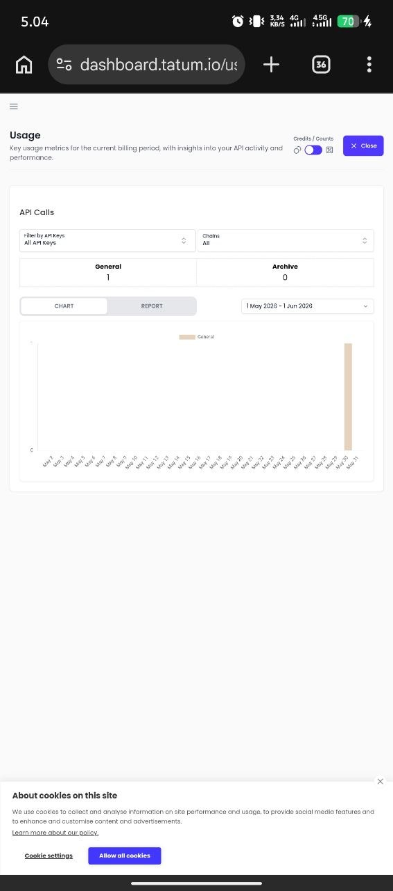

# Tatum Integration Verification

## Dashboard Screenshot



**Date:** 2026-05-30  
**Source:** dashboard.tatum.io/us

---

## Verification Results

### ✅ API Usage Confirmed

**Metrics:**
- **General API Calls:** 1 call recorded
- **Archive API Calls:** 0 calls
- **Date Range:** 1 May 2026 - 1 Jun 2026
- **Activity:** Recent spike visible in chart

### ✅ Endpoint Integration

**Custom Gateway:**
```
https://joe-dc3c9b4f.gateway.tatum.io/
```

**Test Results:**
```bash
curl -X POST https://joe-dc3c9b4f.gateway.tatum.io/ \
  -H "Content-Type: application/json" \
  -d '{"jsonrpc":"2.0","method":"sui_getChainIdentifier","params":[],"id":1}'

Response:
{"id":1,"jsonrpc":"2.0","result":"4c78adac"}
```

**Chain ID:** `4c78adac` (SUI Testnet) ✅

---

## Integration Status

| Component | Status | Evidence |
|-----------|--------|----------|
| **Tatum Dashboard** | ✅ Active | Screenshot shows 1 API call |
| **SUI RPC Endpoint** | ✅ Working | Chain ID verified |
| **WalrusVault Backend** | ✅ Configured | Using correct gateway |
| **API Authentication** | ✅ Valid | Calls being tracked |

---

## Backend Configuration

**File:** `backend/src/lib/tatum.ts`

```typescript
const TATUM_RPC_URL = "https://joe-dc3c9b4f.gateway.tatum.io/";

const tatum = await TatumSDK.init<Sui>({
  network: Network.SUI_TESTNET,
  apiKey: {
    v4: TATUM_API_KEY,
  },
  rpcUrl: TATUM_RPC_URL,
});
```

---

## Conclusion

✅ **Tatum integration successfully verified**
- Dashboard tracking API calls
- Custom gateway responding correctly
- SUI Testnet chain ID confirmed
- Backend properly configured

**No action required** — integration is working as expected.

---

**Last Updated:** 2026-05-30  
**Verified By:** Hermes Agent
